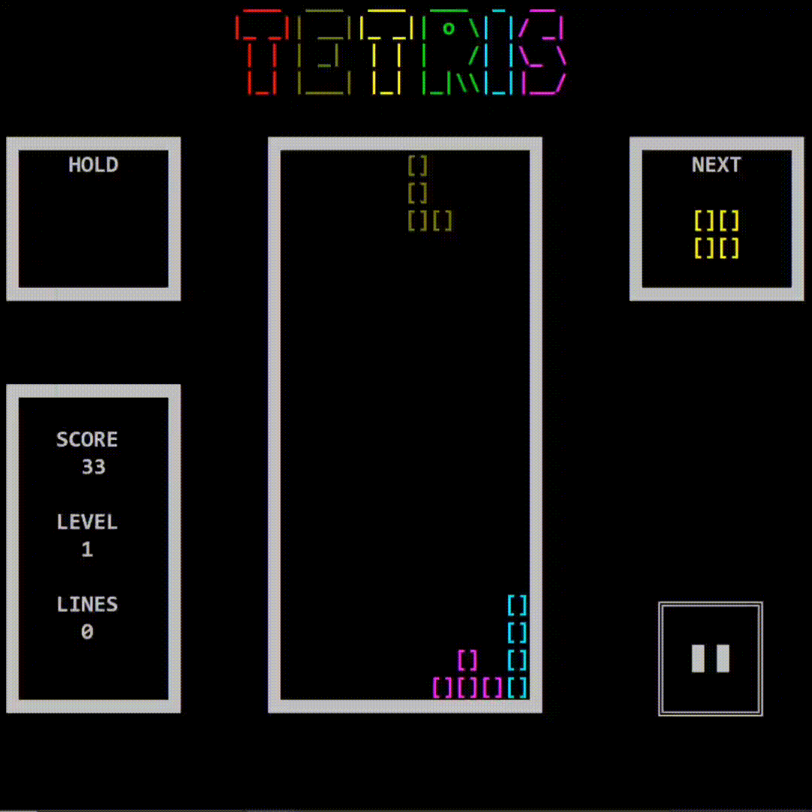
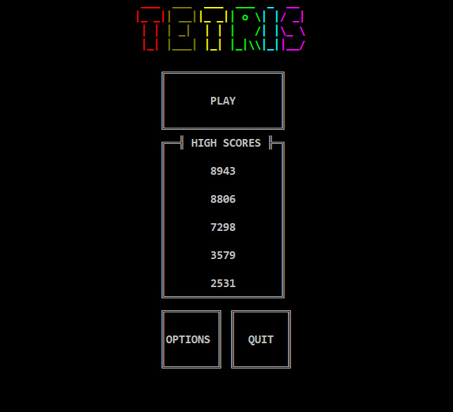
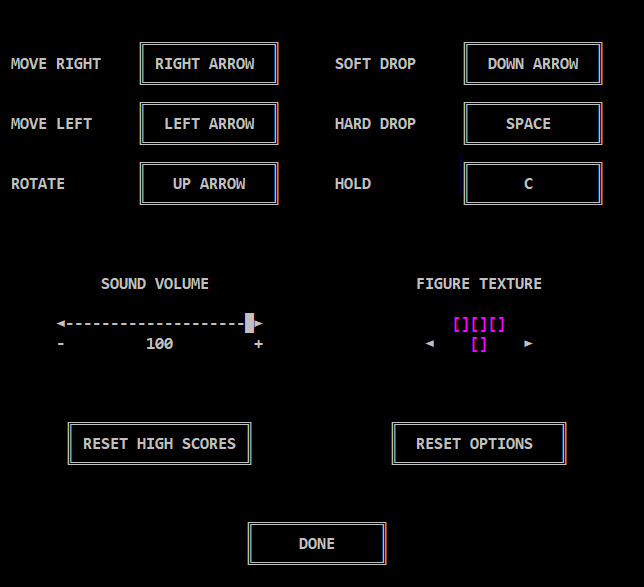

# Tetris в консоли на C++

## Описание
Это версия Tetris полностью реализована в консоли с использованием собственного консольного GUI движка. 

**Геймплей:**

**Главное меню:**

  

**Опции:**

  

## Особенности

- **Заставка:** Приветственная заставка, создающая атмосферу перед началом игры.
- **Музыкальное сопровождение:** Наслаждайтесь звуковым сопровождением во время игры, создающим дополнительную атмосферу.
- **Меню игры:** Интерактивное меню с разнообразными опциями для настройки и запуска игры.
- **Настройки:** Возможность настроить различные параметры игры, чтобы сделать ее более персонализированной.
- **Пауза и сохранение:** Пауза в игре и автоматическое сохранение данных пользователя для продолжения в будущем.
- **Работа с цветом:** Использование цветов для более яркого и привлекательного визуального восприятия.
- **Разнообразные кнопки:** Интуитивное управление с использованием разнообразных клавиш для лучшего опыта игры.

## Инструкции по установке и запуску

1. **Скачайте файл Tetris.rar, который находится в ркпозитории**
   - Распакуйте скачанный RAR-файл в удобное для вас место.

2. **Устранение ошибки с OpenAl32.dll (при необходимости)**
   - Если при запуске Tetris.exe возникает ошибка об отсутствии OpenAl32.dll, скачайте эту библиотеку с официального сайта https://www.openal.org.

3. **Запустите игру**
   - Перейдите в распакованную папку с проектом.
   - Запустите Tetris.exe.

## Платформа
Игра предназначена для платформы Windows.

## Управление

- **Стрелка влево:** Переместить фигуру влево.
- **Стрелка вправо:** Переместить фигуру вправо.
- **Стрелка вниз:** Ускорить падение фигуры.
- **Пробел:** Фигура незамедлительно падает.
- **С:** Заменить фигуру.
- **Esc:** Пауза.

## Заметки
- Игра поддерживает интуитивное управление с клавиатуры.
- Экспериментируйте с настройками и наслаждайтесь консольным визуальным и игровым опытом.

## Автор

**Kirill**

https://github.com/kz306438
